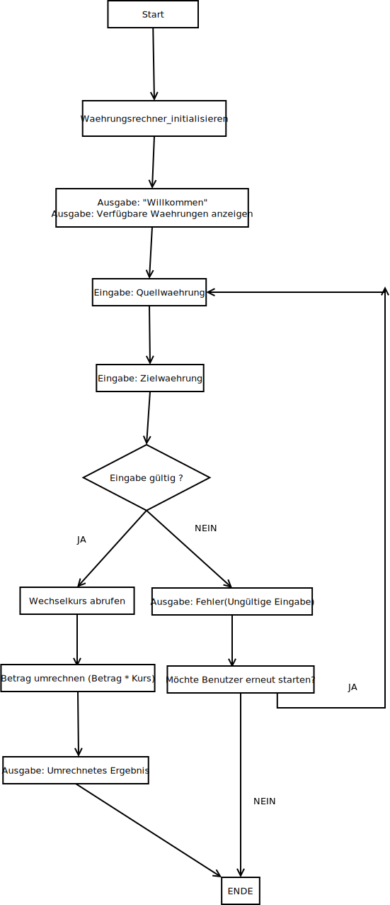

# Currency-Converter

## Beschreibung

Dieses Projekt ist ein einfacher Währungsumrechner mit einer grafischen Benutzeroberfläche (GUI), der mit Java erstellt wurde. Er ermöglicht grundlegende operationen umrechnungen in verschiedene Währungen.

## Funktionen

* Einfache und benutzerfreundliche GUI.
* Grundlegende Operationen.
* Hinzufügen von Daten.
* Umrechnung von Daten.
* Einbindung eines Hintergrundbildes.

## Anwendungslogik 

## Autor

* \[Dennis Garscha]
